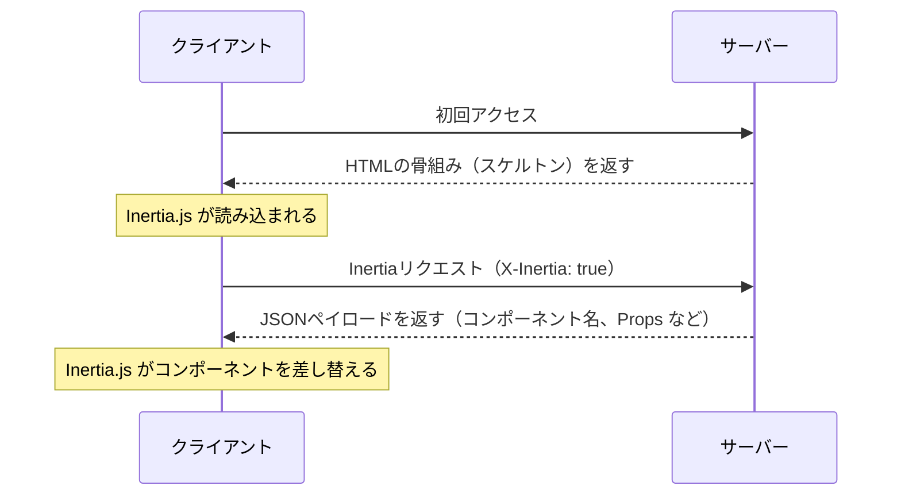

このページには、Inertia プロトコルの詳細な仕様が記載されています。まずは全体像を把握するために、[仕組み](/v2/core-concepts/how-it-works) ページを先に読むようにしてください。

## HTML レスポンス

Inertia アプリへの最初のリクエストは、特別な Inertia ヘッダーやデータを含まない、通常のフルページのブラウザリクエストです。これらのリクエストに対して、サーバーは完全な HTML ドキュメントを返します。

この HTML レスポンスには、サイトのアセット（CSS、JavaScript）に加えて、ページの body 内にルート `<div>` が含まれます。このルート `<div>` はクライアントサイドアプリのマウントポイントとして機能し、初期ページ用の JSON エンコードされた [ページオブジェクト](#the-page-object) を含む `data-page` 属性を持ちます。Inertia はこの情報を使ってクライアントサイドフレームワークを起動し、初期ページコンポーネントを表示します。

```http
REQUEST
GET: https://example.com/events/80
Accept: text/html, application/xhtml+xml

RESPONSE
HTTP/1.1 200 OK
Content-Type: text/html; charset=utf-8

<html>
    <head>
        <title>My app</title>
        <link href="/css/app.css" rel="stylesheet">
        <script src="/js/app.js" defer></script>
    </head>
    <body>
        <div id="app" data-page='{"component":"Event","props":{"errors":{},"event":{"id":80,"title":"Birthday party","start_date":"2019-06-02","description":"Come out and celebrate Jonathan&apos;s 36th birthday party!"}},"url":"/events/80","version":"c32b8e4965f418ad16eaebba1d4e960f"}'></div>
    </body>
</html>
```

初期レスポンスは HTML ですが、Inertia は JavaScript のページコンポーネントをサーバーサイドレンダリングしません。サーバーサイドレンダリングについては、[SSR ドキュメント](/v2/advanced/server-side-rendering) を参照してください。

## Inertia レスポンス

Inertia アプリが起動すると、その後のすべてのリクエストは `X-Inertia` ヘッダーが `true` に設定された XHR 経由で送信されます。このヘッダーは、リクエストが Inertia によるものであり、通常のフルページ遷移ではないことを示します。

サーバーが `X-Inertia` ヘッダーを検出すると、完全な HTML ドキュメントの代わりに、エンコードされた [ページオブジェクト](#the-page-object) を含む JSON レスポンスを返します。

```http
REQUEST
GET: https://example.com/events/80
Accept: text/html, application/xhtml+xml
X-Requested-With: XMLHttpRequest
X-Inertia: true
X-Inertia-Version: 6b16b94d7c51cbe5b1fa42aac98241d5

RESPONSE
HTTP/1.1 200 OK
Content-Type: application/json
Vary: X-Inertia
X-Inertia: true

{
    "component": "Event",
    "props": {
        "errors": {},
        "event": {
            "id": 80,
            "title": "Birthday party",
            "start_date": "2019-06-02",
            "description": "Come out and celebrate Jonathan's 36th birthday party!"
        }
    },
    "url": "/events/80",
    "version": "6b16b94d7c51cbe5b1fa42aac98241d5",
    "encryptHistory": true,
    "clearHistory": false
}
```

## リクエストライフサイクル図

以下の図は、Inertia アプリケーション内でのリクエストライフサイクルを示しています。初回訪問では標準的なリクエストがサーバーに送信され、ハイドレート済みデータを含むルート要素を持つ HTML アプリケーションのスケルトンが返されます。その後のユーザー操作やナビゲーションでは、Inertia が JSON データを返す XHR リクエストを送信します。Inertia はこのレスポンスを使って、フルページリロードを行うことなくページコンポーネントを動的にハイドレートして差し替えます。




## リクエストヘッダー

以下のヘッダーは、Inertia がリクエストを行う際に自動的に送信されます。これらを手動で設定する必要はなく、Inertia のクライアントサイドアダプターによって処理されます。

<ParamField header="X-Inertia" type="boolean">
  これが Inertia リクエストであることを示すために `true` に設定されます。
</ParamField>

<ParamField header="X-Requested-With" type="string">
  すべての Inertia リクエストで `XMLHttpRequest` に設定されます。
</ParamField>

<ParamField header="Accept" type="string">
  許可されるレスポンスタイプを示すために `text/html, application/xhtml+xml` に設定されます。
</ParamField>

<ParamField header="X-Inertia-Version" type="string">
  アセットの不一致をチェックするための現在のアセットバージョン。
</ParamField>

<ParamField header="Purpose" type="string">
  [プリフェッチ](/v2/data-props/prefetching) リクエストを行う際に `prefetch` に設定されます。
</ParamField>

<ParamField header="X-Inertia-Partial-Component" type="string">
  [部分リロード](/v2/data-props/partial-reloads) 用のコンポーネント名。
</ParamField>

<ParamField header="X-Inertia-Partial-Data" type="string">
  部分リロードに含める props のカンマ区切りリスト。
</ParamField>

<ParamField header="X-Inertia-Partial-Except" type="string">
  部分リロードから除外する props のカンマ区切りリスト。
</ParamField>

<ParamField header="X-Inertia-Reset" type="string">
  ナビゲーション時にリセットする props のカンマ区切りリスト。
</ParamField>

<ParamField header="Cache-Control" type="string">
  古いコンテンツが提供されるのを防ぐため、リロードリクエストでは `no-cache` に設定されます。
</ParamField>

<ParamField header="X-Inertia-Error-Bag" type="string">
  [バリデーションエラー](/v2/the-basics/validation) で使用するエラーバッグを指定します。
</ParamField>

<ParamField header="X-Inertia-Infinite-Scroll-Merge-Intent" type="string">
  [無限スクロール](/v2/data-props/infinite-scroll) 使用時に、取得したデータを追加（append）または前方追加（prepend）するかを示します。
</ParamField>

<ParamField header="X-Inertia-Except-Once-Props" type="string">
  クライアント側ですでに読み込まれている、期限切れでない [once prop](/v2/data-props/once-props) のキーのカンマ区切りリスト。サーバーは、部分リロードで明示的に要求されるか、サーバー側で強制的に再取得されない限り、これらの props を解決しません。
</ParamField>

以下のヘッダーは、[Precognition](/v2/the-basics/forms#precognition) バリデーションリクエストで使用されます。

<ParamField header="Precognition" type="boolean">
  これが Precognition バリデーションリクエストであることを示すために `true` に設定されます。
</ParamField>

<ParamField header="Precognition-Validate-Only" type="string">
  バリデーションするフィールド名のカンマ区切りリスト。
</ParamField>

## レスポンスヘッダー

以下のヘッダーは、Inertia レスポンスでサーバーサイドアダプターから送信されるべきものです。公式のサーバーサイドアダプターを使用している場合、これらは自動的に処理されます。

<ParamField header="X-Inertia" type="boolean">
  これが Inertia レスポンスであることを示すために `true` に設定されます。
</ParamField>

<ParamField header="X-Inertia-Location" type="string">
  アセットバージョンの不一致により `409 Conflict` レスポンスが返される際の、外部リダイレクトに使用されます。
</ParamField>

<ParamField header="Vary" type="string">
  HTML レスポンスと JSON レスポンスを正しく区別できるようにするため、`X-Inertia` に設定されます。
</ParamField>

以下のヘッダーは、[Precognition](/v2/the-basics/forms#precognition) バリデーションレスポンスで使用されます。

<ParamField header="Precognition" type="string">
  これが Precognition バリデーションレスポンスであることを示すために `true` に設定されます。
</ParamField>

<ParamField header="Precognition-Success" type="string">
  バリデーションがエラーなく成功した場合に、`204 No Content` ステータスコードとともに `true` に設定されます。
</ParamField>

<ParamField header="Vary" type="string">
  Precognition ミドルウェアが適用されている場合、すべてのレスポンスで `Precognition` に設定されます。
</ParamField>

## ページオブジェクト

Inertia は、ページオブジェクトを介してサーバーとクライアント間でデータを共有します。このオブジェクトには、ページコンポーネントをレンダリングし、ブラウザの履歴状態を更新し、サイトのアセットバージョンを追跡するために必要な情報が含まれます。ページオブジェクトには、以下のプロパティを含めることができます。

<ParamField body="component" type="string">
  JavaScript ページコンポーネントの名前。
</ParamField>

<ParamField body="props" type="object">
  ページの props。ページデータ全体と、`errors` オブジェクト（エラーがない場合はデフォルトで `{}`）を含みます。
</ParamField>

<ParamField body="url" type="string">
  ページの URL。
</ParamField>

<ParamField body="version" type="string|number">
  現在の [アセットバージョン](/v2/advanced/asset-versioning)。
</ParamField>

<ParamField body="encryptHistory" type="boolean">
  [現在のページの履歴状態を暗号化するかどうか](/v2/security/history-encryption)。
</ParamField>

<ParamField body="clearHistory" type="boolean">
  [暗号化された履歴状態をクリアするかどうか](/v2/security/history-encryption#clearing-history)。
</ParamField>

<ParamField body="mergeProps" type="array">
  ナビゲーション中に [マージ](/v2/data-props/merging-props)（追加）されるべき prop キーの配列。
</ParamField>

<ParamField body="prependProps" type="array">
  ナビゲーション中に [先頭に追加](/v2/data-props/merging-props) されるべき prop キーの配列。
</ParamField>

<ParamField body="deepMergeProps" type="array">
  ナビゲーション中に [ディープマージ](/v2/data-props/merging-props#deep-merge) されるべき prop キーの配列。
</ParamField>

<ParamField body="matchPropsOn" type="array">
  [props のマージ時に一致判定に使用する](/v2/data-props/merging-props#matching-items) prop キーの配列。
</ParamField>

<ParamField body="scrollProps" type="object">
  [無限スクロール](/v2/data-props/infinite-scroll) における prop マージ動作の設定。
</ParamField>

<ParamField body="deferredProps" type="object">
  クライアントサイドでの [props の遅延読み込み](/v2/data-props/deferred-props) 設定。
</ParamField>

<ParamField body="onceProps" type="object">
  [once props](/v2/data-props/once-props) の設定。これらは一度だけ解決され、以降のページで再利用されます。各エントリはキーを、`prop` 名と任意の `expiresAt` タイムスタンプ（ミリ秒）を含むオブジェクトにマッピングします。
</ParamField>

通常のフルページ遷移では、ページオブジェクトはルート `<div>` の `data-page` 属性に JSON エンコードされます。Inertia 遷移（`X-Inertia` ヘッダーの存在で示される）の場合、ページオブジェクトは JSON ペイロードとして返されます。

### 基本的なページオブジェクト

最小限のページオブジェクトは、コアとなるプロパティを含みます。

```json
{
    "component": "User/Edit",
    "props": {
        "errors": {},
        "user": {
            "name": "Jonathan"
        }
    },
    "url": "/user/123",
    "version": "6b16b94d7c51cbe5b1fa42aac98241d5",
    "clearHistory": false,
    "encryptHistory": false
}
```

### 遅延 props を含むページオブジェクト

遅延 props を使用する場合、ページオブジェクトには `deferredProps` 設定が含まれます。遅延 props は後続のリクエストで読み込まれるため、初期 props には含まれない点に注意してください。

```json
{
    "component": "Posts/Index",
    "props": {
        "errors": {},
        "user": {
            "name": "Jonathan"
        }
    },
    "url": "/posts",
    "version": "6b16b94d7c51cbe5b1fa42aac98241d5",
    "clearHistory": false,
    "encryptHistory": false,
    "deferredProps": {
        "default": [
            "comments",
            "analytics"
        ],
        "sidebar": [
            "relatedPosts"
        ]
    }
}
```

### マージ props を含むページオブジェクト

マージ props を使用する場合、追加の設定が含まれます。

```json
{
    "component": "Feed/Index",
    "props": {
        "errors": {},
        "user": {
            "name": "Jonathan"
        },
        "posts": [
            {
                "id": 1,
                "title": "First Post"
            }
        ],
        "notifications": [
            {
                "id": 2,
                "message": "New comment"
            }
        ],
        "conversations": {
            "data": [
                {
                    "id": 1,
                    "title": "Support Chat",
                    "participants": [
                        "John",
                        "Jane"
                    ]
                }
            ]
        }
    },
    "url": "/feed",
    "version": "6b16b94d7c51cbe5b1fa42aac98241d5",
    "clearHistory": false,
    "encryptHistory": false,
    "mergeProps": [
        "posts"
    ],
    "prependProps": [
        "notifications"
    ],
    "deepMergeProps": [
        "conversations"
    ],
    "matchPropsOn": [
        "posts.id",
        "notifications.id",
        "conversations.data.id"
    ]
}
```

### スクロール props を含むページオブジェクト

[無限スクロール](/v2/data-props/infinite-scroll) を使用する場合、ページオブジェクトには `scrollProps` 設定が含まれます。

```json
{
    "component": "Posts/Index",
    "props": {
        "errors": {},
        "posts": {
            "data": [
                {
                    "id": 1,
                    "title": "First Post"
                },
                {
                    "id": 2,
                    "title": "Second Post"
                }
            ]
        }
    },
    "url": "/posts?page=1",
    "version": "6b16b94d7c51cbe5b1fa42aac98241d5",
    "clearHistory": false,
    "encryptHistory": false,
    "mergeProps": [
        "posts.data"
    ],
    "scrollProps": {
        "posts": {
            "pageName": "page",
            "previousPage": null,
            "nextPage": 2,
            "currentPage": 1
        }
    }
}
```

### once props を含むページオブジェクト

[once props](/v2/data-props/once-props) を使用する場合、ページオブジェクトには `onceProps` 設定が含まれます。各エントリはキーを、prop 名と任意の有効期限タイムスタンプにマッピングします。

```json
{
    "component": "Billing/Plans",
    "props": {
        "errors": {},
        "plans": [
            {
                "id": 1,
                "name": "Basic"
            },
            {
                "id": 2,
                "name": "Pro"
            }
        ]
    },
    "url": "/billing/plans",
    "version": "6b16b94d7c51cbe5b1fa42aac98241d5",
    "clearHistory": false,
    "encryptHistory": false,
    "onceProps": {
        "plans": {
            "prop": "plans",
            "expiresAt": null
        }
    }
}
```

同じ once prop を含む次のページへ遷移する際、クライアントは読み込み済みのキーを `X-Inertia-Except-Once-Props` ヘッダーで送信します。サーバーはこれらの props の解決をスキップし、レスポンスから除外します。クライアントは以前に読み込んだ値を再利用します。

```http
REQUEST
GET: https://example.com/billing/upgrade
Accept: text/html, application/xhtml+xml
X-Requested-With: XMLHttpRequest
X-Inertia: true
X-Inertia-Version: 6b16b94d7c51cbe5b1fa42aac98241d5
X-Inertia-Except-Once-Props: plans

RESPONSE
HTTP/1.1 200 OK
Content-Type: application/json

{
    "component": "Billing/Upgrade",
    "props": {
        "errors": {},
        "currentPlan": {
            "id": 1,
            "name": "Basic"
        }
    },
    "url": "/billing/upgrade",
    "version": "6b16b94d7c51cbe5b1fa42aac98241d5",
    "clearHistory": false,
    "encryptHistory": false,
    "onceProps": {
        "plans": {
            "prop": "plans",
            "expiresAt": null
        }
    }
}
```

この例では、`plans` は `onceProps` に含まれていますが、すでにクライアント側で読み込まれているため `props` には含まれていません。`onceProps` のキーはページ間で once prop を識別するためのものであり、`prop` は実際の prop 名を指定します。[カスタムキー](/v2/data-props/once-props#custom-keys) を使用する場合、これらは異なる場合があります。

## アセットバージョニング

シングルページアプリでよくある課題の 1 つは、アセットが変更された際にサイトのアセットを更新することです。Inertia では、サイトの現在のアセットバージョンを任意で追跡することで、これを簡単に実現できます。アセットが変更された場合、Inertia は XHR 訪問ではなく、自動的にフルページ訪問を行います。

Inertia の [ページオブジェクト](#the-page-object) には `version` 識別子が含まれます。この識別子はサーバーサイドで設定され、数値、文字列、ファイルハッシュなど、サイトのアセットの現在の「バージョン」を表す任意の値にできます。重要なのは、アセットが更新されたときにこの値が変わることです。

Inertia リクエストが行われるたびに、Inertia は現在のアセットバージョンを `X-Inertia-Version` ヘッダーに含めます。サーバーはこのヘッダーに含まれるバージョンと、現在のアセットバージョンを比較します。これは通常、サーバーサイドフレームワークのミドルウェア層で処理されます。

アセットバージョンが同じ場合、リクエストは通常どおり処理されます。一方、アセットバージョンが異なる場合、サーバーは即座に `409 Conflict` レスポンスを返し、`X-Inertia-Location` ヘッダーに URL を含めます。サーバーサイドでリダイレクトが発生している可能性があるため、このヘッダーが必要です。これにより、Inertia は最終的に意図された遷移先 URL を認識できます。

<Tip>
注意: `409 Conflict` レスポンスは `GET` リクエストに対してのみ送信され、`POST/PUT/PATCH/DELETE` リクエストには送信されません。ただし、これらのリクエストの後に `GET` リダイレクトが発生した場合には送信されます。
</Tip>

Inertia クライアントが `409 Conflict` レスポンスを受信すると、`X-Inertia-Location` ヘッダーの存在を確認します。このヘッダーが存在する場合、Inertia はヘッダーで指定された URL へのフルページ訪問を行います。これにより、常に最新のアセットが読み込まれた状態が保証されます。

`409 Conflict` レスポンスが発生した際に「フラッシュ」セッションデータが存在する場合、Inertia のサーバーサイドフレームワークアダプターは自動的にこのデータを再フラッシュします。

```http
REQUEST
GET: https://example.com/events/80
Accept: text/html, application/xhtml+xml
X-Requested-With: XMLHttpRequest
X-Inertia: true
X-Inertia-Version: 6b16b94d7c51cbe5b1fa42aac98241d5

RESPONSE
409: Conflict
X-Inertia-Location: https://example.com/events/80
```

詳細については、[アセットバージョニング](/v2/advanced/asset-versioning) ページを参照してください。

## 部分リロード

Inertia リクエストを行う際、部分リロードオプションを使用すると、同じページコンポーネントへの再訪問時に、サーバーから props（データ）の一部のみを取得できます。一部のページデータが古くなっても問題ない場合、これは有効なパフォーマンス最適化になります。詳細は [部分リロード](/v2/data-props/partial-reloads) ドキュメントを参照してください。

部分リロードリクエストが行われると、Inertia は `X-Inertia-Partial-Component` ヘッダーを含め、必要に応じて `X-Inertia-Partial-Data` および / または `X-Inertia-Partial-Except` ヘッダーをリクエストに含めます。

`X-Inertia-Partial-Data` ヘッダーは、返却してほしい props（データ）キーのカンマ区切りリストです。

`X-Inertia-Partial-Except` ヘッダーは、返却しない props（データ）キーのカンマ区切りリストです。このヘッダーのみが含まれる場合、指定されたもの以外のすべての props（データ）が送信されます。`X-Inertia-Partial-Data` と `X-Inertia-Partial-Except` の両方が含まれる場合は、`X-Inertia-Partial-Except` が優先されます。

`X-Inertia-Partial-Component` ヘッダーには、部分リロード対象のコンポーネント名が含まれます。部分リロードは同じページコンポーネントへのリクエストでのみ機能するため、これは必須です。何らかの理由で最終的な遷移先が異なる場合（例: ユーザーがログアウトしてログインページに遷移した場合）、部分リロードは行われません。

```http
REQUEST
GET: https://example.com/events
Accept: text/html, application/xhtml+xml
X-Requested-With: XMLHttpRequest
X-Inertia: true
X-Inertia-Version: 6b16b94d7c51cbe5b1fa42aac98241d5
X-Inertia-Partial-Data: events
X-Inertia-Partial-Component: Events

RESPONSE
HTTP/1.1 200 OK
Content-Type: application/json

{
    "component": "Events",
    "props": {
        "auth": {...},       // 含まれない
        "categories": [...], // 含まれない
        "events": [...],     // 含まれる
        "errors": {}         // 常に含まれる
    },
    "url": "/events/80",
    "version": "6b16b94d7c51cbe5b1fa42aac98241d5"
}
```

## HTTP ステータスコード

Inertia は、さまざまなシナリオを処理するために特定の HTTP ステータスコードを使用します。

| ステータスコード | 説明 |
|:-----------------|:------------------------------------------------------------------------------------------------------------------------------------------------------------------------------------------------------------|
| **200 OK**       | HTML レスポンスおよび Inertia JSON レスポンスの両方における標準的な成功レスポンス。 |
| **302 Found**    | 標準的なリダイレクトレスポンス。Inertia のサーバーサイドアダプターは、`PUT`、`PATCH`、`DELETE` リクエストの後に返された場合、これを自動的に `303 See Other` に変換します。 |
| **303 See Other**| 非 GET リクエスト後のリダイレクトに使用されます。このステータスコードは、ブラウザに対してリダイレクト先 URL への `GET` リクエストを行うよう指示し、元のリクエストメソッドが繰り返されることで発生し得る重複送信を防ぎます。 |
| **409 Conflict** | アセットバージョンの不一致、または外部リダイレクト時に返されます。アセットの不一致の場合はフルページリロードを促します。外部リダイレクトの場合、レスポンスには `X-Inertia-Location` ヘッダーが含まれ、クライアントサイドで `window.location` によるリダイレクトがトリガーされます。 |

以下のステータスコードは、[Precognition](/v2/the-basics/forms#precognition) バリデーションリクエストで使用されます。

| ステータスコード              | 説明 |
|:-----------------------------|:------------------------------------------------------------------------------------------------|
| **204 No Content**           | バリデーションエラーのない、成功した Precognition バリデーションリクエスト。 |
| **422 Unprocessable Entity** | バリデーションエラーを含む Precognition バリデーションリクエスト。レスポンスボディにエラーが含まれます。 |
